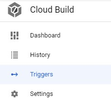
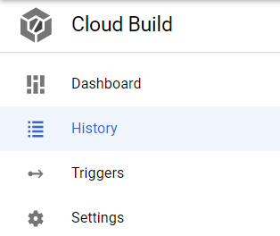

# Introduction

Cloud Build is a serverless CI/CD platform in Google Cloud.

# Cloud Build Pipelines
Cloud Build triggers are used to run a set of build steps that are defined in a YAML file. Pipelines can run from a manual start or from an automated start based on a monitored file being updated.

# Cloud Build Triggers 
Triggers can define the repository, branch, files to monitor, YAML file location, and substitution variables that are used during a CI/CD run. Cloud Build triggers can be created inside the GCP console. Using the navigation menu (hamburger menu) or the Resource Search Bar find the Cloud Build resource.

In the Cloud Build resource click `Triggers` and then `Create Trigger`. Give the trigger a name, description, and associate the trigger with a source repository and branch on that repository.

Use the `Included files filter` to point to a specific file that needs to be tracked for modifications. Point the `Cloud Build configuration file location` field to the path of the YAML file that will be used to run your defined build steps.

Triggers can be edited at any time in the GCP Console by clicking the three dots to the right of the trigger. 

# Modifications to Trigger the Pipeline

When the tracked branch and file listed under `Included files filter` are updated for a specific trigger this will start a Cloud Build build. Progress on the pipeline can be viewed in Cloud Build through the History option.

